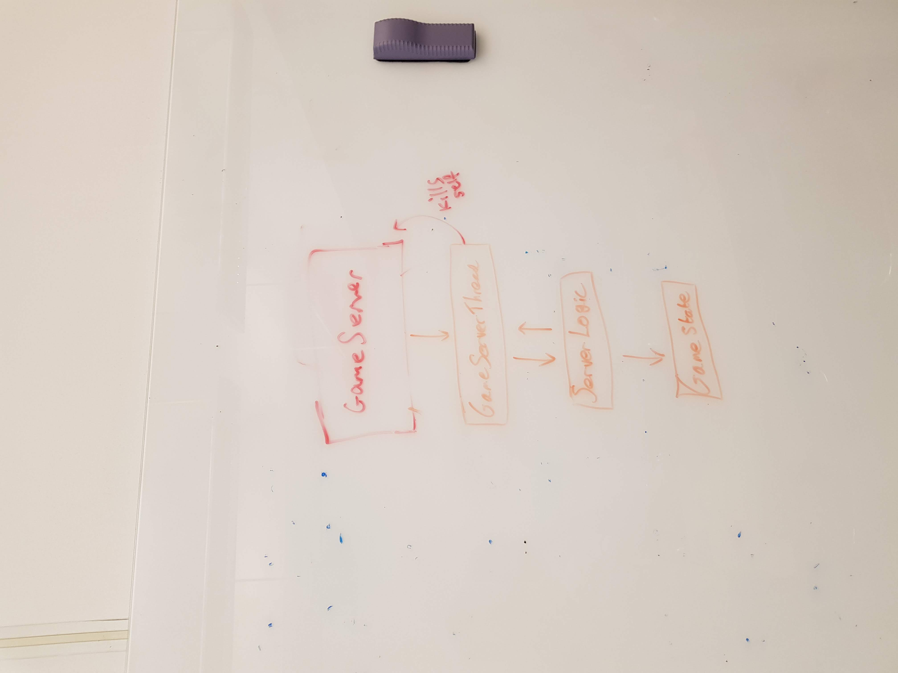
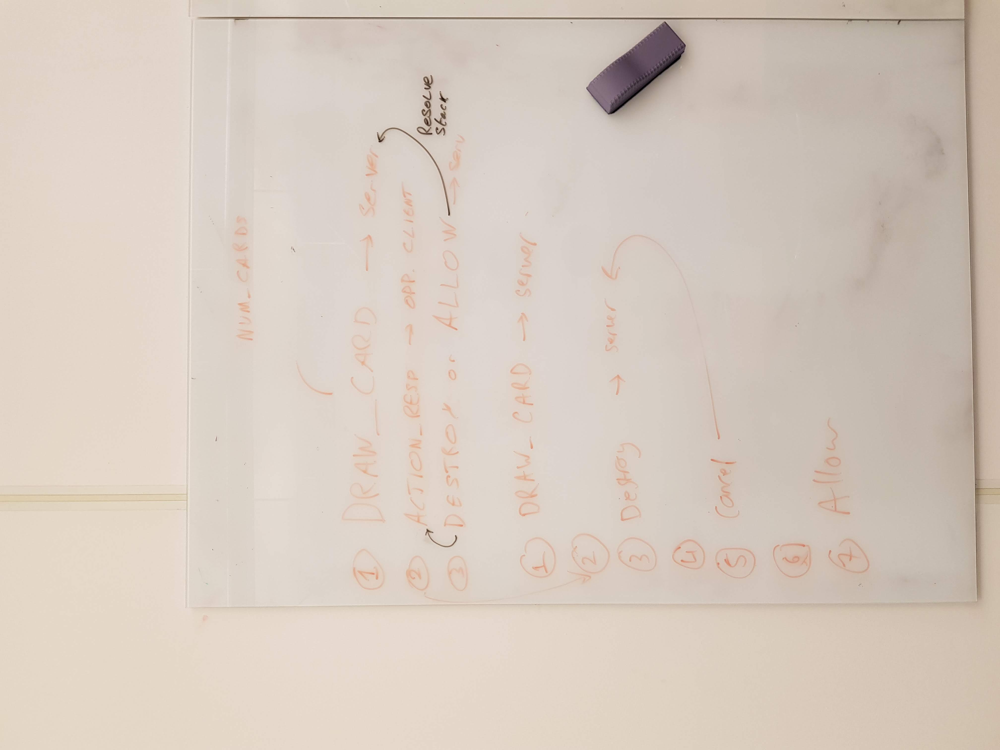

# Networking

### Handling the drawing of cards at the beginning of a game
The game allows for mulligans to be performed when the user initially draws their cards at the start of the game - the user can choose to trade in their 6 drawn cards for 5 different cards. This can be continued, for progressively less cards each time.
1) The server sends a GAME_START command to all clients, informing them of their randomly-drawn decks, at which point the clients are then allowed to either perform a mulligan, or to accept their drawings.
2) The user requests to re-draw cards, and the client sends a GAME_START_MULLIGAN command to the server, informing the server that they wish to perform a mulligan.
3) The server then draws the needed cards and sends a new GAME_START command to the player, which the player can then either decline or accept.
4) The user chooses to accept these cards and the client then sends a GAME_START_ACCEPT command to the server, at which point the process finishes.

The server will wait for all clients to send a GAME_START_ACCEPT command before starting the game.

### Handling the creation of a passworded game
The game allows for passworded and non-passworded games to be created and joined. As such, there needs to be a way to figure out whether or not the game should be passworded.
1) The host machine will create a new instance of GameServer, by utilising the 

### Handling Connecting Players
The game allows for 1v1 multiplayer and singleplayer games, both of which utilise the same client and server code. Below is the process by which a game starts
1) The host machine will create a new instance of GameServer, which will then accept connections on port 3789.
2) When a client connects to the server, GameServer will then spawn a new instance of GameServerReceiver and GameServerSender for each connection. GameServerReceiver will then wait for a valid JOIN_GAME command to be sent. Once this has been received by the server, this client will then be 'confirmed'.
3) When the required number of clients have been 'confirmed', then GameServer will send out a GAME_INIT command to all players, which will inform them of the player list. GameServer will then terminate.
4) Once this has been done, the only server threads remaining will be the respective sender and receiver threads for each of the clients connected.

### Handling Player Actions
The rules of the game allow for players to draw cards, etc - these can each be responded to with another player action by the other player than is playing. For instance:

1) TURN_START is sent from server -> client #1
2) DRAW_CARD is sent from client #1 -> server
3) DRAW_CARD_RESP is sent from server -> client #2 (with isInResponse = false)
4) DESTROY_CARD is sent from client #2 -> server (in response to DRAW_CARD_RESP)
5) DESTROY_CARD_RESP is sent from server -> client #1
6) ALLOW_ACTION is sent from client #1 -> server as client #1 can't take any action.
7) Server then resolves stack of actions and sends out relevant commands updating client game states.
8) TURN_END is then sent from client #1 -> server

### Protocol
| Command Name | Instigator | Extra Data | Comments |
|--------------|------------|------------|----------|
| TERMINATE_CONN | Client | | Sent from the client to the server when the client wishes to disconnect from the server. |
| JOIN_GAME | Client | username, deck_data | Sent when a user joins a game |
| JOIN_GAME_RESP | Server | success, message OR player_list | Sent as a response to JOIN_GAME - either success is true, in which case the list of currently-connected and confirmed players will be sent to the user, or success is false, in which case it will send a message detailing why the user could not be connected. |
| PLAYER_JOINED | Server | username, player_id | Sent when a player joins the game |
| GAME_START | Server | DECK | This is sent when all players have joined. |
| DIAG_OFFER | Server | MSG | This is sent when the server wants the client to pick either yes or no. |
| DIAG_RESP | Client | BOOL | This is send in response to DIAG_OFFER and contains the user's selection. |
| MULLIGAN_OFFER | Server | | This is used to offer the client an opportunity to mulligan their cards. | 
| GAME_START_MULLIGAN | Client | | Sent when a player requests a mulligan in response to their drawn cards. |
| GAME_START_ACCEPT | Client | | Sent when a player accepts their drawn cards. |
| GAME_END | Server | winner_id | Sent when the game ends - sent to all clients to inform them of the winner. |
| TURN_START | Server | player_id | Sent when a player starts their turn. |
| TURN_END | Client | | Sent when a player ends their turn. |
| PLAY_CARD | Client | START_POS, END_POS, CARD_ID, ABILITY_TRIGGERED | Sent when a player wishes to play a card from hand -> board. ABILITY_TRIGGERED = true when triggered by ability. |
| PLAY_CARD_RESP | Server | START_POS, END_POS, PLAYER_ID, SUCCESS, CARD_ID | Sent when a player plays a card from hand -> board (sent to all clients) |
| TARGET_CARD | Server | VALID_REGION, MSG | Tells the client to target a card and return an action to the server, where VALID_REGION = array of card pos that user can choose from. MSG = optional, but has custom message to indicate to user what this will be used for |
| TARGET_CARD_RESP | Client | TRIGGER_POS, CARD_POS | Sent from the client back to the server, in response to a TARGET_CARD command |
| LEVEL_MAGE | Server | TARGET, LEVEL | Sent from the server to a client, offering them the option to level up a mage to a specified level | 
| LEVEL_MAGE_RESP | Client | TARGET, OPT | Sent in response to LEVEL_MAGE, OPT = either true or false |
| CASTLE_ATTACK | Server | TRIGGER_POS, TARGET_POS, NEW_HEALTH | Sent when a client successfully targets the opponent's castle and deals some damage. |
| SHUFFLE_DECK | Server | DECK | Sent when the server shuffles the user's deck |
| RETURN_CARD | Client | START_POS | Sent when the client wishes to return a card from their hand to their deck |
| DRAW_CARD | Client | | Sent when a player wishes to draw cards. |
| DRAW_CARD_RESP | Server | DRAWN_CARDS, CLEAR_FLAG, USER_ID | Sent in response to the client sending DRAW_CARD. USER_ID and CLEAR_FLAG are optional parameters |
| DRAW_CARD_OFFER | Server | ID, START_POST, END_POS | Sent to offer the client the option of drawing a card |
| DRAW_CARD_OFFER_IGNORE | Client | | Sent when the client wants to ignore the option of drawing a card |
| DESTROY_CARD | Client | CARD_POS | Sent when the originating player wishes to destroy a card from the opposing player. |
| ATTACK_CARD | Client | ATTACKER, TARGET | Sent when the client wishes to launch an attack on an opponent's card. |
| ATTACK_CARD_RESP | Server | 
| ALLOW_ACTION | Client | | Sent in response to an action from another client, indicating that the client doesn't wish to play a new action in response.
| DESTROY_CARD_RESP | Server | CARD_LOCATIONS, IN_RESPONSE | Sent in response to a client attempting to destroy a card/cards from the opposing player.
| LEVEL_MAGE | Client | TARGET | Sent when a client wishes to level up a mage on the board. |
| LEVEL_MAGE_RESP | Server | SUCCESS, NEW_LEVEL, TARGET | Sent in response to LEVEL_MAGE, includes the new level and whether or not it was successful. |
| ACTIVATE_TRICKSTER | Client | TARGET | Sent when a client wishes to activate a trickster on the board. |
| ACTIVATE_TRICKSTER_RESP | Server | TARGET, RESPONSE_USER_ID, TRICKSTER_POS | Sent in response to ACTIVATE_TRICKSTER. RESPONSE_USER_ID = id of user that this is in response to. |
| MOVE_CARD | Server | CARD_MOVEMENTS | Where card_movements = [[original_pos = card_pos, target_pos = card_pos], ...] Used to move cards from one position to another. | 

### Finding LAN games
Each server allows for receiving UDP broadcast packets while the game has not started. When it receives these packets, it will respond to them with the name of the server, the number of players connected and whether or not the game is passworded.

1) User sends broadcast packet on network: {"COMMAND": "FIND_SERVER", "GAME": "LastOfUs"}
2) Each server will respond with the relevant information, which the client will then receive and add to the server list.
3) The client will continue to allow responses until the client either cancels the process, or joins a game.

### Misc. Diagrams

